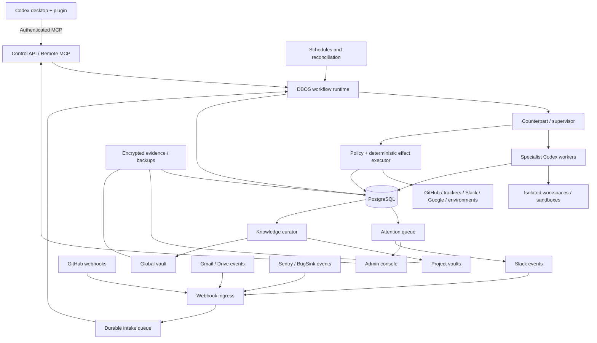

# Agentic Control Plane

## Product and Technical Specification

| Field | Value |
|---|---|
| Status | Proposed build baseline |
| Specification version | 1.0.0 |
| Date | 2026-09-04 |
| Initial owner and operator | David |
| Initial deployment model | Single-user, hosted, multi-project |
| Primary interaction client | Codex |
| Related system | Poppy is a comparison baseline, not a runtime dependency |

This document specifies a new agentic operating system for directing Codex across product management, engineering, operations, communication, knowledge management, and recurring project work. It is intentionally independent of the Poppy repository and runtime.

The words **MUST**, **MUST NOT**, **SHOULD**, **SHOULD NOT**, and **MAY** are normative. Examples are illustrative unless a requirement explicitly incorporates them.

---

## 1. Executive decision

The product SHALL be an always-on hosted control plane around Codex. Codex remains the operator's primary conversational interface and the principal reasoning and engineering harness. The control plane adds durable missions, source-agnostic intake, project-specific policy, resumable worker execution, event-driven coordination, approval management, deterministic external effects, reconciliation, runtime provenance, knowledge synchronization, and live operational visibility.

The initial implementation SHALL use:

- A TypeScript monorepo.
- PostgreSQL for operational state, evidence indexes, lifecycle facts, approvals, and execution history.
- DBOS TypeScript for durable workflows, queues, timers, and recovery.
- Codex SDK workers running on a hosted VPS.
- A remote authenticated MCP server exposed through an installable Codex plugin.
- A lightweight browser-based administrative console.
- A GitHub App, Google OAuth application, and Slack App.
- Official Obsidian Headless Sync for one global vault and one vault per project.
- Docker Compose and/or systemd on a single x86 Hetzner VPS, fronted by Caddy.
- Encrypted backups stored outside the VPS filesystem.

The initial system SHALL use OpenAI models only, but domain interfaces SHALL avoid provider-specific data structures where this is practical. The system MUST NOT introduce another project tracker, communication suite, knowledge product, graph database, or observability platform without a separate evidence-backed decision.

---

## 2. Product definition

### 2.1 Problem statement

The operator routinely owns complete project outcomes across several projects: understanding client input, reconciling evidence, making product decisions, diagnosing defects, writing specifications and tickets, implementing code, coordinating reviews, merging to development, preparing client communication, maintaining project knowledge, and running recurring release or operational processes.

Current workflows exhibit the following structural problems:

1. Work arrives through heterogeneous sources such as Codex, email, Slack, monitoring systems, meetings, and trackers.
2. Client requests are easily confused with agreed scope, verified defects, priorities, decisions, or commitments.
3. Mission completion, tracker status, code integration, deployment, acceptance, and business completion are distinct but are often collapsed into one status.
4. Long-running work loses continuity through conversation compaction or task interruption.
5. Polling, manual worker reintegration, and repeated status checks consume model turns and operator attention.
6. Approvals become stale when branches, cohorts, messages, infrastructure, or other mutable targets change.
7. Prompt-only worker restrictions do not reliably prevent unauthorized mutation.
8. Recurring workflows repeatedly embed large policy prompts rather than invoking versioned workflow definitions.
9. Changed-only processing lacks first-class cursors and explicit coverage guarantees.
10. It can be difficult to establish which repository, plugin, workflow, policy, or runtime version actually performed an action.
11. Cross-system release closeout is important, expensive, and poorly served by engineering-only automation.
12. The operator works on five to ten items concurrently and needs progress without sacrificing laptop responsiveness.
13. Operational information is fragmented; the operator needs a small number of decision-ready attention items rather than constant narration.

### 2.2 Product promise

Given a request, event, schedule, or detected change, the system SHALL be able to establish project context, distinguish evidence from authority, select a bounded mission workflow, execute permitted work through specialist agents and deterministic tools, pause only when human judgment or authority is genuinely required, verify consequential effects, retain useful knowledge, and present an understandable live account of what happened.

### 2.3 Initial user

Version 1 has one human user, owner, approver, and administrator: David. Multi-user organizational distribution is a later phase. The architecture SHOULD avoid needless single-user coupling, but version 1 MUST NOT absorb the complexity of tenancy, team roles, organization-wide credential administration, or enterprise compliance unless needed for the initial operator.

### 2.4 Product boundary

The system is:

- A control plane for durable agentic work.
- A project onboarding and capability-readiness system.
- A mission, evidence, approval, execution, and verification ledger.
- A coordinator of Codex workers and external integrations.
- A synchronizer and curator of project and global knowledge.
- An operational console and attention manager.

The system is not:

- A replacement for Codex.
- A replacement for GitHub, Gmail, Drive, Slack, Obsidian, or project-specific trackers.
- A general autonomous production administrator.
- A universal graph engine.
- A raw transcript archive presented as knowledge.
- A self-modifying agent framework.
- A promise that every external operation is exactly-once.
- A second chat application in version 1.

---

## 3. Goals, non-goals, and success measures

### 3.1 Goals

| ID | Goal |
|---|---|
| G-001 | Increase accepted end-to-end task completion across product, engineering, operational, and communication work. |
| G-002 | Reduce the operator's attention minutes and number of interventions per accepted outcome. |
| G-003 | Reduce turnaround time by maximizing safe parallelism and eliminating polling-based coordination. |
| G-004 | Preserve correctness across long-running, interrupted, or compacted agent sessions. |
| G-005 | Make authority, evidence, current state, approval, and external effects inspectable and reconstructable. |
| G-006 | Operate without depending on the operator's laptop being online. |
| G-007 | Support multiple projects through explicit onboarding and project-specific policies. |
| G-008 | Learn from real work while preventing autonomous changes to system behavior. |
| G-009 | Remain lightweight enough for one owner to deploy, understand, recover, and upgrade. |
| G-010 | Become locally installable and reusable by other project managers after the personal system is validated. |

### 3.2 Non-goals for version 1

| ID | Non-goal |
|---|---|
| NG-001 | Multi-user tenancy, RBAC administration, or organization-wide billing. |
| NG-002 | Slack as a conversational command surface. Slack is initially for intake, status, alerts, and approvals. |
| NG-003 | Fully autonomous production deployments, production data repairs, infrastructure mutations, secret changes, permission changes, or spending. |
| NG-004 | Cross-provider model orchestration. Provider-neutral boundaries are required, but only OpenAI is implemented initially. |
| NG-005 | A graph database, GraphRAG, or automatic extraction of a universal knowledge graph. |
| NG-006 | Replacing a project's existing tracker or the operator's Obsidian workflow. |
| NG-007 | Browser automation where an adequate API, MCP server, or CLI exists. |
| NG-008 | Automatic self-modification of prompts, policies, workflows, schemas, adapters, or source code. |
| NG-009 | Automated client promises, scope acceptance, or prioritization based solely on a client request. |

### 3.3 Success measures

The system SHALL record enough information to calculate:

- Accepted end-to-end completion rate.
- Human interventions and estimated attention minutes per mission.
- Time from intake to decision-ready state.
- Time from authorization to verified outcome.
- Queue time, active execution time, and external waiting time.
- Autonomy rate by risk class and workflow.
- Reopened, rolled-back, or escaped defects.
- Unknown-outcome external effects.
- Approval invalidations caused by drift.
- Evidence and provenance completeness.
- Incorrect classification of client requests as accepted scope or defects.
- Cost per accepted outcome, including model and infrastructure costs where available.
- Context-packet restart success.

Metrics SHALL support evaluation and diagnosis. They MUST NOT automatically trigger broad autonomous work merely because a vague threshold was crossed.

---

## 4. Fixed product decisions

The following decisions are treated as settled for version 1:

1. Codex is the primary interaction client.
2. The runtime is hosted and remains available when the laptop is offline.
3. A lightweight browser console provides live operational visibility, approvals, credential onboarding, and kill switches.
4. GitHub, Gmail/Drive, Slack, and Obsidian are retained.
5. Each project uses its own configured tracker and integration set.
6. There is one global Obsidian vault and one hosted, synchronized vault per project.
7. PostgreSQL is the dedicated execution database.
8. The system uses one counterpart that selects specialist agents based on the mission.
9. Specialist agents are ephemeral; durable state does not depend on their conversation history.
10. Missions use dynamically compiled bounded graphs, not one universal graph.
11. Five to ten missions may be active concurrently, subject to host- and target-specific limits.
12. One writer is allowed per mutable target.
13. Drafting external messages is automatic; sending external messages requires approval in version 1.
14. Internal messages to the operator may be sent automatically.
15. Creating Triage items and updating trackers may be automatic under project policy.
16. Code changes, branches, commits, pushes, pull requests, and development-branch merges may be automatic within guardrails.
17. Staging deployment requires approval unless explicitly covered by an approval envelope and project policy.
18. Production, migrations, infrastructure, secrets, permissions, production data, and spending always require explicit approval.
19. User-visible behavior inferred with high confidence may still auto-merge only after stronger user-perspective acceptance.
20. The system may diagnose its own weaknesses and prepare upgrades, but it may not apply them without approval.
21. Live use begins after essential functional and safety gates; there is no mandatory prolonged shadow period.

---

## 5. Design principles

### 5.1 Evidence before authority

An email, Slack message, issue, transcript, document, monitoring alert, or webpage is evidence. It is not automatically an instruction, decision, commitment, defect classification, or accepted requirement.

### 5.2 Deterministic effects

Models may investigate, reason, draft, and propose typed effects. External mutations SHALL be performed by deterministic executors after policy evaluation.

### 5.3 Facts remain separate

Mission state, code state, environment state, tracker state, acceptance state, effect state, and business completion MUST remain independent facts unless an explicit project mapping says otherwise.

### 5.4 Capability-specific readiness

A project may be ready for diagnosis while unready for deployment. Missing one dependency MUST NOT unnecessarily block unrelated capabilities.

### 5.5 Restartable by construction

Any durable mission MUST be reconstructable from persisted state and bounded context packets. Conversation continuity is a convenience, not a dependency.

### 5.6 One writer per target

Parallelism is encouraged for independent work. Mutation of a shared target requires an exclusive expiring lease.

### 5.7 Event-driven waiting

Waiting SHALL be represented by durable subscriptions, timers, or external events. Polling with repeated agent turns is a fallback, not the normal coordination mechanism.

### 5.8 Version everything that changes behavior

Workflows, policies, project profiles, context-packet schemas, prompts, adapters, runtime artifacts, and database schemas SHALL be versioned and attributable.

### 5.9 No silent absence inference

No events, no search results, or no detected changes MUST NOT be interpreted as healthy or complete if source coverage is missing, expired, or unknown.

### 5.10 Attention is a scarce resource

The system SHOULD continue independent work, consolidate related questions, and escalate only decision-ready items requiring human authority or judgment.

### 5.11 Existing tools must earn replacement

The system SHALL integrate with the operator's established tools. A new product or migration requires evidence of material benefit, migration feasibility, operational cost, and measurable improvement.

---

## 6. Actors and responsibilities

| Actor | Responsibility | Mutation authority |
|---|---|---|
| Operator | Owns policy, approves consequential effects, resolves business ambiguity | Full human authority |
| Counterpart | Interprets requests, selects workflows, integrates results, presents decisions | Proposes effects; no unrestricted credentials |
| Context/intake worker | Resolves project and source context, normalizes input | Read-only except approved internal mission records |
| Research worker | Obtains current external evidence | Read-only |
| Diagnosis worker | Establishes or narrows cause | Read-only by default |
| Decision worker | Produces behavioral contract, scope recommendation, and acceptance criteria | No external mutation |
| Delivery worker | Modifies one isolated candidate workspace and runs local checks | One scoped writable workspace |
| Assurance worker | Independently reviews an exact candidate | Technically read-only |
| Acceptance worker | Tests demonstrated behavior against personas and criteria | Read-only with test/review environment access |
| Coordination worker | Produces tracker and communication proposals | Proposes effects |
| Learning worker | Extracts project or system learning after an evidenced outcome | Project memory writes only where policy permits; system upgrades are proposals |
| Effect executor | Performs a validated typed mutation and verifies its result | Deterministic, policy-scoped credentials |
| Reconciler | Compares external state and advances source coverage | Read-only except internal cursor/coverage records |

---

## 7. System context and architecture



### 7.1 Component responsibilities

#### Control API and remote MCP

- Authenticate the Codex plugin and console.
- Create, inspect, steer, cancel, and resume missions.
- Expose narrow tools with stable typed identifiers.
- Never return credentials or unredacted secret material.
- Provide project readiness and live mission projections.

#### Workflow runtime

- Execute versioned workflow definitions.
- Persist node state, attempts, timers, queues, and subscriptions.
- Recover pending work after restart.
- Pin in-flight missions to behavior versions.
- Enforce concurrency and target leases.

#### Worker manager

- Construct bounded context packets.
- Start Codex SDK workers with role-specific tool manifests.
- Provide isolated filesystems and capability grants.
- Capture structured results and runtime provenance.
- Terminate or recover abandoned worker processes.

#### Policy and effect service

- Classify risk.
- Evaluate project and global policy.
- Produce exact effect previews.
- Validate approval envelopes and preconditions.
- Execute adapter operations deterministically.
- Read back results and create receipts.
- Enter `unknown_outcome` when an effect cannot safely be classified.

#### Reconciliation service

- Maintain source cursors and coverage windows.
- Detect missed events and external drift.
- Correlate external facts with internal records.
- Wake only missions affected by material changes.

#### Knowledge curator

- Turn evidenced outcomes into structured current knowledge.
- Keep project and global learning separate.
- Preserve provenance and supersession.
- Propose system improvements without applying them.

#### Admin console

- Display live mission and lifecycle state.
- Present evidence, approvals, receipts, readiness, health, and cost.
- Manage initial credentials without exposing them to models.
- Provide global and project kill switches.
- Avoid becoming a second conversational surface in version 1.

---

## 8. Deployment topology

Version 1 SHALL run on one x86 VPS with the following logical services:

```text
Caddy
  ├── Console web application
  ├── Control API / remote MCP
  └── Webhook ingress

Application runtime
  ├── DBOS workflow workers
  ├── Codex worker manager
  ├── Effect executor
  ├── Reconciliation scheduler
  └── Knowledge curator

Data
  ├── PostgreSQL
  ├── Encrypted local evidence cache
  ├── Obsidian headless clients
  └── Encrypted off-machine backups
```

Codex App Server or SDK subprocess interfaces MUST remain bound to loopback or an internal private interface. They MUST NOT be directly exposed to the public internet.

The initial host SHOULD provide approximately 8 x86 vCPU, 16 GB RAM, and 160 GB storage. The scheduler SHALL initially allow no more than two simultaneous CPU-intensive hosted jobs. Capacity SHALL be changed based on measured queueing, memory pressure, and accepted task throughput rather than speculative scaling.

The operator's laptop MAY act as an explicitly selected execution host for project-specific local resources, but the normal runtime MUST NOT depend on it.

---

## 9. Mission and lifecycle model

### 9.1 Mission state

Mission state describes orchestration, not the complete real-world outcome.

```text
received
  → triaging
  → needs_input | ready
  → planning
  → awaiting_approval | executing
  → verifying
  → awaiting_external
  → complete_for_scope | failed | cancelled
```

| State | Meaning |
|---|---|
| `received` | Durable intake exists but has not been normalized. |
| `triaging` | Project, source, duplication, authority, and disposition are being established. |
| `needs_input` | Progress depends on a material human decision or missing authority. |
| `ready` | A workflow can be compiled with available capability. |
| `planning` | The bounded mission graph and required gates are being selected. |
| `awaiting_approval` | One or more consequential effects lack current authorization. |
| `executing` | At least one runnable node is active. |
| `verifying` | Candidate behavior or external effects are being independently checked. |
| `awaiting_external` | The mission is waiting for CI, an event, a client, a timer, or another external condition. |
| `complete_for_scope` | The applicable completion contract passed for the mission's stated scope. |
| `failed` | The workflow reached a terminal failure with evidence. |
| `cancelled` | The operator or applicable policy cancelled remaining work. |

`complete_for_scope` MUST include the identifier and version of the completion contract that passed. It MUST NOT imply tracker `Done`, production deployment, client acceptance, or business completion unless those are explicit contract conditions.

### 9.2 Candidate state

```text
not_started → workspace_ready → modified → locally_verified
            → review_pending → reviewed
            → pr_open → ci_pending → merge_ready → merged
            → superseded | abandoned
```

Every candidate transition SHALL identify the exact repository, worktree, branch, commit SHA, and evidence that supports it.

### 9.3 Deployment state

Deployment records are per environment and artifact:

```text
not_deployed → deployment_proposed → authorized → deploying
             → deployed → verifying → verified
             → failed | unknown_outcome | rolled_back
```

The absence of a staging environment SHALL be represented as `not_configured`, not as success or failure.

### 9.4 Acceptance state

```text
not_required | pending | running | passed | failed | waived | invalidated
```

A waiver requires a named authority, reason, exact candidate, scope, timestamp, and expiry where applicable. A change to user-visible behavior invalidates prior acceptance unless covered by a declared tolerance.

### 9.5 Tracker state

The system SHALL preserve native tracker states and identifiers. Project profiles MAY map them to semantic categories such as:

- `intake`
- `selected`
- `in_progress`
- `on_development`
- `ready_for_release`
- `released`
- `done`
- `rejected`

Semantic categories support cross-project reasoning but MUST NOT overwrite the native state model. Tracker transitions require project-specific rules.

### 9.6 Effect state

```text
proposed → previewed → authorized → revalidating → executing
         → applied → verifying → verified
         → failed | unknown_outcome | rolled_back | invalidated
```

An effect is not successful until it is verified. An executor restart after an uncertain network response MUST reconcile the target before retrying.

### 9.7 Completion evaluation

The completion evaluator SHALL:

1. Load the mission's pinned completion contract.
2. Read current facts from each lifecycle dimension.
3. Verify required receipts and evidence freshness.
4. Confirm there are no disqualifying conflicts, unresolved findings, unknown outcomes, or expired waivers.
5. Emit a versioned completion evaluation with pass/fail reasons.
6. Transition only the mission state implied by the result.
7. Propose separate tracker or communication effects where required.

---

## 10. Workflow definitions and bounded graphs

### 10.1 Workflow definition

A workflow definition is immutable after publication and contains:

- Stable workflow identifier.
- Semantic version.
- Supported mission types.
- Node templates and dependency rules.
- Required worker roles.
- Input and output schemas.
- Risk classification rules.
- Default completion contract.
- Required gates.
- Retry and repair limits.
- Allowed optional branches.
- Context-packet schema version.
- Compatible adapter capabilities.
- Migration policy.

A project workflow binding selects a definition version and adds project-specific source mappings, state mappings, completion requirements, limits, quiet hours, and integration accounts.

### 10.2 Graph compilation

The counterpart SHALL compile a mission-specific directed acyclic graph when enough evidence exists to plan the work. The graph MAY be amended when new evidence changes the required path, provided:

- Existing verified results remain immutable.
- New dependencies are explicit.
- Any affected approval is re-evaluated.
- The graph remains bounded by workflow and policy.
- The change is recorded as a graph revision.

The graph MUST NOT allow an agent to invent a new effect type, integration, credential, environment, or risk exception.

### 10.3 Node contract

Every node SHALL specify:

```yaml
node_id:
node_type:
workflow_version:
role:
dependencies:
input_schema:
output_schema:
context_packet_id:
capability_grant_id:
resource_leases:
risk_class:
retry_policy:
timeout_policy:
completion_condition:
failure_disposition:
```

### 10.4 Retry and repair policy

- Deterministic transient operations MAY use bounded backoff.
- Model-based repair loops SHALL stop after two materially identical failures or three unsuccessful cycles in total by default.
- A different project value MAY be configured if it narrows risk or is explicitly approved.
- Unknown external outcomes MUST be reconciled before retry.
- A worker MUST NOT repeatedly consume turns while awaiting an external event.
- The system SHOULD continue independent branches while another branch is blocked.

### 10.5 Workflow version upgrades

New missions SHALL use the current project binding. Existing missions remain pinned to their original workflow version unless:

- They are allowed to finish under the previous runtime; or
- A versioned migration function succeeds; and
- The migration creates an auditable before/after record; and
- Material approval assumptions are revalidated.

---

## 11. Source-agnostic intake

### 11.1 Supported origins

The intake layer SHALL normalize at least:

- Direct Codex requests.
- Client or internal email.
- Slack messages and threads.
- Sentry or BugSink events.
- Project tracker items.
- Meeting transcripts and recordings.
- Google Drive documents.
- Scheduled and reconciliation triggers.

No workflow may require Sentry/BugSink as the only valid starting point.

### 11.2 Intake envelope

```typescript
type IntakeEnvelope = {
  intakeId: string;
  receivedAt: string;
  origin: "codex" | "gmail" | "slack" | "sentry" | "bugsink" |
          "tracker" | "meeting" | "drive" | "schedule" | "other";
  immutableSourceRef: string;
  externalEventId?: string;
  projectCandidates: Array<{ projectId: string; confidence: number; basis: string[] }>;
  reporter?: { externalId?: string; displayName?: string; organization?: string };
  occurredAt?: string;
  subject?: string;
  rawEvidenceRefs: string[];
  relatedSourceRefs: string[];
  correlationKeys: string[];
  sensitivity: "public" | "project_confidential" | "restricted";
};
```

The envelope stores references to raw evidence; it SHOULD NOT duplicate large or sensitive source content in mission events.

### 11.3 Intake processing requirements

| ID | Requirement |
|---|---|
| FR-INT-001 | Webhook signatures and source authenticity MUST be validated before processing. |
| FR-INT-002 | External delivery identifiers MUST be deduplicated. |
| FR-INT-003 | The original source and retrieval timestamp MUST be preserved. |
| FR-INT-004 | Project identification MUST expose uncertainty and request confirmation when material. |
| FR-INT-005 | External content MUST be treated as untrusted data, including text that appears to instruct the agent. |
| FR-INT-006 | Requests, claims, decisions, commitments, observations, and attachments MUST be separated. |
| FR-INT-007 | Duplicate or related prior work SHOULD be identified before creating a new tracker item. |
| FR-INT-008 | Client-reported behavior MUST NOT automatically become a verified defect. |
| FR-INT-009 | A client request MUST NOT automatically become agreed scope, priority, or commitment. |
| FR-INT-010 | Project policy MAY automatically create a native tracker item in `Triage`. |
| FR-INT-011 | Intake processing MUST create an explicit disposition or an evidence-backed reason it remains unresolved. |

### 11.4 Intake dispositions

- Verified or likely defect
- Feature or change request
- Support or usage question
- Incident
- Duplicate or continuation
- Already resolved
- Not warranted or out of scope
- Insufficient evidence
- Wrong project or source
- Requires business decision

Disposition is a claim with provenance and confidence, not an irreversible label.

---

## 12. Claims, evidence, authority, and confidence

### 12.1 Claim types

```text
agreed_fact
reported_assertion
observation
hypothesis
inference
request
decision
commitment
requirement
acceptance_criterion
superseded_claim
disputed_claim
```

### 12.2 Claim fields

```typescript
type Claim = {
  claimId: string;
  projectId?: string;
  type: string;
  statement: string;
  status: "active" | "unverified" | "conflicted" | "superseded" | "rejected";
  authority: number;
  freshness: number;
  corroboration: number;
  completeness: number;
  inferenceDistance: number;
  confidence: number;
  sourceEvidenceIds: string[];
  assertedBy?: string;
  validFrom?: string;
  validUntil?: string;
  supersedes?: string[];
  createdByRunId: string;
};
```

Confidence SHALL be explainable from its dimensions. Project-specific calibration MAY change how dimensions are weighted only after operator approval. Confidence NEVER expands effect authority.

### 12.3 Source hierarchy

Each project profile SHALL define authority by claim type. A source can be authoritative for one kind of claim and weak for another.

For meeting work, the default is:

- Recording/transcript: primary evidence for what was said.
- Operator notes: perspective-correcting authority and emphasis.
- Explicit documented decision: authority for what was decided.
- Tracker or signed-off specification: authority for committed scope where project policy says so.
- Generated summary: derivative evidence only.

Conflicting credible sources produce `conflicted`, not a guessed resolution.

### 12.4 Evidence requirements

Evidence records SHALL include:

- Stable identifier.
- Project and source.
- Retrieval or observation timestamp.
- Content hash where possible.
- Source version, revision, message ID, event ID, or URL.
- Sensitivity classification.
- Retention policy.
- Redacted summary suitable for model context.
- Link to raw or immutable content where retained.
- Freshness and accessibility status.

Missing, inaccessible, stale, malformed, or insufficient evidence SHALL remain explicitly unverified.

---

## 13. Project onboarding and readiness

### 13.1 Onboarding behavior

Onboarding SHALL automatically discover available project information and then ask the operator to confirm or correct the complete proposed project profile. It SHALL also identify required information that could not be discovered.

Onboarding creates:

- Versioned project profile in PostgreSQL.
- Initial project-vault structure and profile.
- Integration and capability records.
- Initial source cursors or declared baselines.
- Workflow bindings.
- Completion contracts.
- Quiet-hours and attention rules.
- Readiness assessment.

### 13.2 Project profile

The profile SHALL cover:

1. Project identity, client, stakeholders, and environments.
2. Repositories, default branches, development branches, protection, and ownership.
3. Tracker, native states, semantic state mapping, item types, and transition policy.
4. Tests, linting, builds, CI, review rules, and expected gates.
5. Deployment paths, staging availability, production authority, verification, and rollback.
6. Product context, business context, scope boundaries, design direction, personas, and acceptance methods.
7. Communication channels, external recipients, internal recipients, and message approval rules.
8. Knowledge sources, authority by claim type, freshness expectations, and memory destinations.
9. Data sensitivity, restricted sources, redaction, and retention.
10. Workflows, schedules, reconciliation sources, cursor strategies, and completion contracts.
11. Quiet hours, escalation rules, failure thresholds, and unattended work limits.
12. Host requirements, browser requirements, and concurrency limits.
13. Credential references and available read/write identities.
14. Mutable-target revalidation methods.
15. Runtime or adapter compatibility requirements.

### 13.3 Capability readiness

Readiness is assessed per capability:

```text
available
degraded
unconfigured
blocked
stale
revoked
unknown
```

Examples include:

- Read repository
- Create isolated worktree
- Run required tests
- Read tracker
- Write Triage item
- Push branch
- Open pull request
- Verify CI
- Merge development branch
- Deploy staging
- Read Gmail
- Draft Gmail
- Send Gmail
- Read/write project vault
- Notify operator in Slack

The system SHOULD perform useful degraded work when safe. It MUST clearly report which later effects cannot be completed and why.

### 13.4 Profile authority

Project profiles MAY narrow global permissions and limits. They MUST NOT expand global authority. Profile changes that broaden effects, destinations, production access, or data exposure require explicit operator approval.

---

## 14. Risk, approvals, and external effects

### 14.1 Risk classes

| Class | Description | Default behavior |
|---|---|---|
| R0 | Read-only investigation, evidence gathering, analysis, internal drafts | Automatic |
| R1 | Reversible local/project work such as structured notes, Triage items, branches, and commits | Automatic within project policy |
| R2 | Guarded engineering effects such as push, PR creation, bounded code repair, and development merge | Automatic after required gates and policy checks |
| R3 | External communication, staging deployment, unusually broad changes, or other material non-production effects | Approval envelope required unless a valid project envelope already covers it |
| R4 | Production deployment or data, migrations, infrastructure, secrets, permissions, irreversible operations, or spending | Separate exact approval required |

Risk may be increased by scope, uncertainty, blast radius, reversibility, data sensitivity, novelty, or conflicts. Project policy may lower automatic authority but may not weaken the global R4 rule.

### 14.2 Effect proposal

All external mutations SHALL be represented by a typed effect proposal:

```typescript
type EffectProposal = {
  effectId: string;
  missionId: string;
  projectId: string;
  type: string;
  adapterId: string;
  target: { type: string; externalId: string; displayName: string };
  payload: unknown;
  preview: string;
  riskClass: "R0" | "R1" | "R2" | "R3" | "R4";
  rationale: string;
  evidenceIds: string[];
  candidateRevision?: string;
  idempotencyKey: string;
  requiredPreconditions: PreconditionSpec[];
  verificationPlan: VerificationStep[];
  rollbackPlan?: RollbackStep[];
  proposedByRunId: string;
};
```

### 14.3 Approval envelope

An approval envelope SHALL include:

```typescript
type ApprovalEnvelope = {
  approvalId: string;
  approverId: string;
  projectId: string;
  missionId?: string;
  allowedEffectTypes: string[];
  allowedTargetIds: string[];
  payloadDigests?: string[];
  candidateRevisions?: string[];
  behavioralContractId?: string;
  maximumRiskClass: string;
  maximumChangeSize?: ChangeLimit;
  allowedEnvironments: string[];
  requiredGates: string[];
  allowedRepairClasses: string[];
  nonMaterialDriftPolicy?: DriftPolicy;
  preconditionSnapshotIds: string[];
  rollbackAuthorization?: string[];
  validFrom: string;
  expiresAt: string;
  quietHoursBehavior: "defer" | "continue_if_preapproved";
};
```

Approval MUST be exact enough that the operator can understand the target, effect, material behavior, blast radius, validation, and rollback. An approval of an investigation is not approval of a mutation discovered during that investigation.

### 14.4 Material approval drift

An approval SHALL be invalidated when any unpermitted change affects:

- Target identity or recipient.
- Candidate SHA or artifact digest.
- User-visible behavior.
- Scope or change size.
- Environment.
- Required permissions.
- Migration status.
- Production exposure.
- Data cohort, row count, predicate, or relevant source version.
- Required verification or rollback feasibility.
- Material source conflict.
- Applicable project or global policy.

Non-material drift may continue only when the envelope defines the tolerance and the executor records the actual drift.

### 14.5 Pre-effect revalidation

Immediately before execution, the effect service SHALL:

1. Re-read the target through the authoritative adapter.
2. Recompute required preconditions.
3. Compare them with the approved snapshot.
4. Re-evaluate risk and policy.
5. Confirm the approval has not expired or been revoked.
6. Acquire the target's writer lease.
7. Execute only if all conditions pass.

Mutable-target preconditions MAY include:

- Branch or pull-request head SHA.
- Repository default/development branch.
- Artifact digest.
- API ETag or object version.
- Message content hash and recipients.
- Query/predicate hash.
- Result count and cohort digest.
- Current environment release.
- Current permission assignments.
- Tracker state and updated timestamp.

### 14.6 Execution and verification

The adapter SHALL return an immediate execution record even if final success is unknown. Verification then reads the target independently.

```text
proposed
  → policy-approved
  → human-approved if required
  → preconditions valid
  → lease acquired
  → execution attempted
  → read-back verification
  → verified receipt
```

If the response is lost after the remote system may have applied the effect, the executor SHALL enter `unknown_outcome`, release no success-dependent nodes, and reconcile using the idempotency key, external identifiers, target history, or resulting state.

### 14.7 Rollback

Automatic rollback is permitted only when:

- The rollback mechanism is predeclared.
- The rollback target and effect class are authorized.
- It was tested in staging where staging exists.
- Revalidation confirms the rollback still applies.
- Rollback is safer than leaving the failed change in place.

Otherwise, the system prepares a rollback proposal and escalates it.

### 14.8 Effect requirements

| ID | Requirement |
|---|---|
| FR-FX-001 | Models MUST NOT hold unrestricted credentials for external mutation. |
| FR-FX-002 | Every material external effect MUST have a named target, preview, authority basis, idempotency key, verification plan, and receipt. |
| FR-FX-003 | R4 effects MUST receive separate exact approval. |
| FR-FX-004 | A stale or materially drifted approval MUST fail closed. |
| FR-FX-005 | Unknown outcome MUST be distinct from failure and success. |
| FR-FX-006 | The system MUST reconcile an unknown outcome before retrying. |
| FR-FX-007 | Effect verification SHOULD use a separate read operation from execution. |
| FR-FX-008 | An effect receipt MUST record runtime and policy provenance. |

---

## 15. Worker capability enforcement

### 15.1 Capability grants

Workers SHALL receive expiring grants scoped to:

- Mission and node.
- Project.
- Role.
- Tool or adapter operation.
- Resource and target.
- Read/write mode.
- Workspace.
- Network destination where enforceable.
- Time and attempt count.

A capability grant SHALL be denied by default when no rule grants it.

### 15.2 Isolation profiles

#### Read-only profile

- Repository or artifact mounted read-only.
- Writable ephemeral scratch directory.
- No write credentials.
- No direct effect executor access.
- Read-only connector operations only.
- Network restricted to declared read sources where practical.

#### Delivery profile

- One isolated writable worktree.
- Exclusive workspace lease.
- Local build/test commands allowed by project profile.
- No production secrets.
- No direct push, merge, tracker, deployment, or messaging credentials.
- Typed effect proposals returned to the supervisor.

#### Acceptance profile

- Exact candidate or review environment.
- Personas and acceptance criteria where available.
- Test accounts and data only as configured.
- No candidate modification.
- Ability to capture screenshots, recordings, subtitles, and structured findings.

#### Effect-executor profile

- No general model reasoning requirement.
- Narrow adapter operation.
- Scoped server-side credential.
- Mandatory precondition and policy evaluation.
- Mandatory result verification.

### 15.3 Resource leases

Each mutable target SHALL have a canonical lease key, for example:

```text
repo:<repo-id>:worktree:<mission-id>
branch:<repo-id>:<branch-name>
tracker:<adapter-id>:<item-id>
vault:<vault-id>:<relative-path>
release:<project-id>:<release-id>
deployment:<project-id>:<environment>
```

Leases SHALL have an owner, expiry, heartbeat, and recovery state. A unique database constraint MUST prevent concurrent active writer leases for the same key.

### 15.4 Tool mediation

Removing a named tool from a prompt is insufficient. The implementation SHALL combine tool-manifest restriction with filesystem permissions, credential separation, adapter authorization, and effect-service mediation.

---

## 16. Context packets, compaction, and resumability

### 16.1 Context packet requirements

A worker context packet SHALL be generated from durable records and contain only material, bounded information:

1. Mission objective and explicit non-goals.
2. Requested completion scope.
3. Project profile identifier and version.
4. Workflow, policy, and completion-contract versions.
5. Current lifecycle vector.
6. Behavioral contract and acceptance criteria.
7. Source-authority rules applicable to the node.
8. Selected evidence summaries with stable references and hashes.
9. Active decisions, conflicts, and unresolved questions.
10. Candidate, deployment, and tracker identifiers and versions.
11. Previous structured node results.
12. Approval and capability boundaries.
13. Required output schema.
14. Current node, next action, retry count, and limits.

Packets MUST NOT depend on hidden conversation history. They MUST NOT include credentials. Raw evidence SHOULD be retrieved on demand through scoped references.

### 16.2 Context selection

The packet builder SHALL prefer:

- Current authoritative claims over superseded narrative.
- Stable references over pasted copies.
- Decisions and acceptance criteria over entire conversations.
- Exact source excerpts necessary for the task over broad raw dumps.
- Explicit conflicts and unknowns over false synthesis.

### 16.3 Worker result contract

Every worker SHALL return a schema-validated result containing:

- Terminal status.
- Conclusion or output.
- Evidence references used.
- Claims produced or challenged.
- Artifacts produced.
- Exact candidate revision where applicable.
- Findings and severity.
- Proposed effects.
- Risks and unresolved questions.
- Suggested next nodes.
- Resource and model usage.

Free-form narrative MAY accompany the result but SHALL NOT replace required fields.

### 16.4 Resume behavior

On restart, the orchestrator SHALL reconstruct runnable nodes from PostgreSQL, re-establish or recover leases, generate fresh context packets, and reconcile any interrupted effects. Previously verified effects MUST NOT be repeated.

The test suite MUST deliberately terminate workers at node and effect boundaries to prove this behavior.

---

## 17. Scheduling, cursors, and reconciliation

### 17.1 Schedule definition

A schedule SHALL reference a workflow binding rather than replaying workflow policy in its prompt.

```typescript
type Schedule = {
  scheduleId: string;
  projectId: string;
  workflowBindingId: string;
  triggerDefinition: string;
  enabled: boolean;
  quietHoursPolicyId: string;
  inputOverrides?: Record<string, unknown>;
  lastAttemptAt?: string;
  lastSuccessfulAt?: string;
};
```

Workflow and project changes occur through versioned definitions and bindings, not by editing every schedule prompt.

### 17.2 Source cursor

```typescript
type SourceCursor = {
  cursorId: string;
  projectId: string;
  sourceId: string;
  cursorType: string;
  cursorValueEncryptedOrOpaque: string;
  lastCoveredThrough?: string;
  status: "valid" | "expired" | "invalid" | "unknown";
  lastValidatedAt: string;
  recoveryStrategy: string;
};
```

### 17.3 Coverage window

A reconciliation run SHALL record coverage separately for each source:

```typescript
type CoverageWindow = {
  sourceId: string;
  requestedFrom?: string;
  requestedThrough: string;
  coveredFrom?: string;
  coveredThrough?: string;
  state: "complete" | "partial" | "unknown";
  gaps: Array<{ from?: string; through?: string; reason: string }>;
  changeSetId?: string;
};
```

### 17.4 Reconciliation requirements

| ID | Requirement |
|---|---|
| FR-REC-001 | Webhooks SHALL trigger processing but SHALL NOT be treated as proof of complete source coverage. |
| FR-REC-002 | Every event-driven source SHALL have an appropriate scheduled reconciliation strategy. |
| FR-REC-003 | Changed-only workflows MUST use durable cursors or an explicit bounded comparison window. |
| FR-REC-004 | Cursors advance only after durable processing of the associated change set. |
| FR-REC-005 | Cursor expiry or source failure MUST produce partial or unknown coverage. |
| FR-REC-006 | Reconciliation MUST be idempotent at the source-change level. |
| FR-REC-007 | A failed downstream effect MUST NOT erase evidence that the source change was observed. |
| FR-REC-008 | Coverage gaps MUST remain visible until repaired, waived, or declared unrecoverable by an authorized decision. |

### 17.5 Event-driven waits

The workflow runtime SHALL persist subscriptions to:

- Worker completion.
- GitHub checks and review events.
- Tracker changes.
- Slack interactions.
- Gmail and Drive change signals.
- Deployment callbacks.
- Timers and retry deadlines.
- Approval decisions.

A waiting mission consumes no active model worker. Periodic polling is allowed only when the external system offers no event or reliable long-polling interface, and it SHALL use bounded backoff without invoking an agent for unchanged state.

---

## 18. Runtime provenance

### 18.1 Provenance record

Every worker run, workflow transition, approval evaluation, and effect receipt SHALL reference a provenance record containing:

- Source repository commit.
- Built artifact or container digest.
- Deployed service instance and version.
- Codex plugin version.
- Worker implementation version.
- Workflow version.
- Policy version.
- Project profile version.
- Completion-contract version.
- Adapter and API version.
- Database schema version.
- Model identifier and relevant configuration.
- Context-packet schema version and packet digest.
- Credential reference version without secret material.
- Host identifier and execution environment.

### 18.2 Runtime handshake

On connection, the Codex plugin and hosted API SHALL exchange compatible protocol and version information. The system SHALL display or block incompatible combinations.

### 18.3 Health and mismatch reporting

The console SHALL surface:

- Currently deployed version.
- Desired version.
- Pending migration or restart.
- Active missions pinned to older versions.
- Connector-version incompatibilities.
- Plugin/server mismatch.
- Database migration status.

No health claim may be inferred only from the absence of errors.

---

## 19. Attention management

### 19.1 Attention item types

- Exact approval requested
- Business or product decision required
- Material ambiguity
- Credible source conflict
- Approval invalidated by drift
- Unknown external outcome
- Repeated automated repair failure
- Failed independent acceptance
- Credential expired or revoked
- Capability became unavailable
- Critical incident notification
- Unrecoverable coverage gap

### 19.2 Attention item contract

```typescript
type AttentionItem = {
  itemId: string;
  projectId: string;
  missionIds: string[];
  type: string;
  urgency: "low" | "normal" | "high" | "critical";
  title: string;
  explanation: string;
  whyHumanIsNeeded: string;
  recommendation?: string;
  alternatives?: string[];
  consequenceOfNoAction?: string;
  evidenceIds: string[];
  effectPreviewIds?: string[];
  allowedResponses: string[];
  expiresAt?: string;
  deduplicationKey: string;
  quietHoursDisposition: string;
};
```

### 19.3 Behavior

- Equivalent items SHALL be deduplicated.
- Related low-urgency items SHOULD be grouped into a project digest.
- Critical incidents MAY interrupt quiet hours with an internal Slack alert.
- Quiet hours MUST NOT authorize remediation that was not already permitted.
- Independent mission branches SHOULD continue while another branch awaits input.
- The console SHALL provide a live queue; Slack SHALL carry actionable internal notifications.
- External stakeholder messages remain separate approved effects.

The initial console MAY limit mission editing, but it MUST support approval/rejection, credential onboarding, and kill-switch actions because these are control functions rather than conversational authoring.

---

## 20. Priority workflow specifications

### 20.1 WF-ISSUE: Source-agnostic issue delivery

#### Purpose

Turn a report from any supported source into a verified disposition and, where warranted, a preserved implementation merged to the configured development branch with correct tracker and stakeholder state.

#### Preconditions

- Project is identified or identification can be safely confirmed.
- Read access exists for the relevant evidence sources.
- Capability readiness is known for later effects.
- Project defines its tracker, repository, development branch, and completion contract for the requested scope.

#### Workflow

1. **Normalize intake**
   - Preserve the source and immutable identifiers.
   - Separate observations, requests, proposed causes, desired outcomes, and attachments.
   - Detect duplicate delivery.

2. **Resolve project and authority**
   - Load the project profile.
   - Identify authoritative product, technical, and scope sources.
   - Flag untrusted instructions embedded in source content.

3. **Correlate**
   - Search related tracker items, prior reports, pull requests, commits, releases, decisions, and known limitations.
   - Link duplicates or continuations.

4. **Triage and disposition**
   - Determine whether evidence supports defect, feature request, support issue, incident, duplicate, out-of-scope request, or insufficient evidence.
   - Preserve disagreement between client framing and verified disposition.

5. **Tracker synchronization**
   - Create or update a native tracker item in `Triage` when policy permits.
   - Store source links, evidence, current disposition, uncertainty, and next action.
   - Do not make a commitment through ticket creation.

6. **Diagnosis**
   - Reproduce or narrow cause using read-only access where practical.
   - Distinguish observed cause from hypothesis.
   - Establish affected versions, environments, and user impact.

7. **Decision and behavioral contract**
   - Determine whether a change is warranted.
   - Produce scope, non-goals, acceptance criteria, risk, rollout, and verification plan.
   - Use a preflight approval when material ambiguity or complexity requires it.

8. **Prepare candidate**
   - Create isolated worktree and branch.
   - Implement within a writer lease.
   - Run targeted checks followed by required broader gates sequentially.
   - Record exact commit SHA and test evidence.

9. **Independent assurance**
   - Provide the exact candidate, contract, evidence, and repository rules to a technically read-only reviewer.
   - Resolve or explicitly waive all material findings.

10. **Acceptance**
    - Test user-visible behavior from documented personas and criteria where possible.
    - Otherwise create a review app or recorded, subtitled walkthrough for operator/client acceptance.
    - Bind acceptance to the exact candidate.

11. **GitHub delivery**
    - Propose and execute push/PR effects under policy.
    - Wait for CI through events.
    - Allow bounded repairs and repeat assurance/gates after candidate changes.
    - Merge only the expected SHA into the configured development branch.

12. **Post-merge verification**
    - Read the merged branch and resulting SHA.
    - Verify development environment behavior where configured.
    - Record any unavailable verification explicitly.

13. **Lifecycle and communication**
    - Evaluate the workflow completion contract.
    - Move the tracker only to the project-defined state, such as `On Dev`.
    - Notify the operator automatically.
    - Draft external communication; obtain approval before sending.

14. **Learning and closure**
    - Retain useful project learning with provenance.
    - Create system-improvement proposals when execution exposed a repeatable weakness.
    - Never convert `merged_to_dev` into business `Done` unless the contract explicitly requires and proves it.

#### Failure behavior

- Missing optional staging produces a declared degraded path, not a fabricated check.
- Same-class repair failure stops under the configured retry rule.
- Unrelated issues discovered during work become separate Triage candidates.
- Material scope change recompiles the graph and invalidates affected approval.
- Conflicting evidence returns to decision or attention rather than being silently resolved.

### 20.2 WF-RELEASE: Release closeout and cross-system reconciliation

#### Purpose

Reconcile a release or bounded delivery window across source control, tracker, environments, documentation, communication, and other project-specific systems while processing only new or changed information.

#### Workflow

1. Establish the release identifier, branch, artifact, environment, and comparison window.
2. Snapshot source cursors and requested coverage.
3. Gather changed PRs, commits, tracker items, deployments, documents, and relevant communications.
4. Correlate records using stable IDs, links, branch names, issue keys, revisions, and bounded semantic matching.
5. Build a release cohort with explicit included, excluded, uncertain, and conflicting members.
6. Verify deployment and environment facts independently of code merge state.
7. Compare tracker states with project lifecycle mappings and completion contracts.
8. Detect missing release notes, tracker transitions, documentation, approvals, stakeholder communication, or finance/administrative follow-up where configured.
9. Prepare proposed tracker updates, release notes, internal status, and external messages.
10. Execute automatic effects and request approval for external or higher-risk effects.
11. Read back every applied mutation.
12. Emit a closeout report with per-source coverage and unresolved gaps.
13. Advance each source cursor only through the fully processed window.

#### Required outputs

- Release cohort and selection basis.
- Current code, deployment, tracker, acceptance, and communication state.
- Applied and pending effects.
- Source coverage matrix.
- Unresolved gaps or conflicts.
- Next cursor values.
- Completion evaluation for the release workflow.

### 20.3 WF-FEATURE: Ambiguous feature delivery

#### Purpose

Turn a loose client description into a justified, testable, user-appropriate implementation while incorporating project, product, business, design, and technical context.

#### Additional requirements

- A client request is input to discovery, not acceptance of scope.
- The system SHALL find prior decisions, product constraints, comparable behavior, user journeys, design patterns, and business context.
- Inferences SHALL be labeled and confidence explained.
- High-confidence inference may remove a pre-implementation question, but it does not remove user-perspective acceptance.
- Material product or design alternatives SHALL be presented when the evidence does not support one dominant direction.
- Scope creep SHALL be identified and kept distinct from the smallest warranted outcome.

#### Acceptance hierarchy

1. Independent acceptance agent using approved personas and criteria.
2. Review app demonstrating the exact candidate.
3. Recorded and subtitled walkthrough of the exact candidate.
4. Operator acceptance.
5. Client acceptance where project policy or unresolved product judgment requires it.

### 20.4 WF-MEETING: Meeting reconciliation and client-ready notes

#### Inputs

- Recording and transcript where available.
- Operator's personal notes where available.
- Previous meeting notes.
- Project decisions, open actions, tracker state, and relevant source material.

#### Source treatment

- Transcript/recording is primary capture evidence for what occurred.
- Personal notes refine interpretation, correct perspective, and signal importance.
- Neither source silently overrides an explicit prior or subsequent approved decision.

#### Outputs

The workflow SHALL create separate structured outputs for:

- Decisions made.
- Client requests.
- Accepted commitments.
- Proposed or unaccepted requests.
- Action items with owner and due date where supported.
- Unresolved questions.
- Contradictions with previous notes or current project facts.
- Internal/private observations.
- Client-ready meeting summary.
- Proposed tracker updates.
- Draft Slack or email message.

Internal notification to the operator is automatic. Sending a client-ready message externally requires approval.

### 20.5 WF-PROD-REPAIR: Production repair

This workflow is disabled in the first deployment. Enabling it requires a distinct project readiness decision and successful verification of R4 safeguards.

When enabled, it SHALL require:

- Exact target environment and resource.
- Read-only investigation first.
- Explicit query/predicate and expected cohort.
- Preview of every intended mutation class.
- Cohort count and digest where feasible.
- Exact approval with expiry.
- Immediate pre-effect revalidation.
- Bounded batches where supported.
- Per-batch receipts.
- Post-effect verification.
- Tested rollback or explicit recovery plan.
- Immediate stop on material cohort drift.

---

## 21. Integration contracts

### 21.1 Common adapter interface

Every adapter SHOULD implement the capabilities it supports from this contract:

```typescript
interface Adapter {
  discover(input: DiscoverRequest): Promise<DiscoverResult>;
  read(input: ReadRequest): Promise<ReadResult>;
  draft?(input: DraftRequest): Promise<DraftResult>;
  preview?(input: EffectRequest): Promise<EffectPreview>;
  execute?(input: AuthorizedEffectRequest): Promise<EffectAttemptResult>;
  verify?(input: VerificationRequest): Promise<VerificationResult>;
  rollback?(input: AuthorizedRollbackRequest): Promise<EffectAttemptResult>;
  reconcile?(input: ReconciliationRequest): Promise<ChangeSet>;
  health(): Promise<CapabilityHealth>;
}
```

Adapters SHALL expose stable external IDs, source versions, observed timestamps, idempotency support, required scopes, supported verification, and known rollback limitations.

Preference order is API or supported MCP, then CLI, then browser automation.

### 21.2 GitHub

The GitHub integration SHALL use a GitHub App with minimum required permissions and short-lived installation tokens.

It SHALL support:

- Repository and branch discovery.
- Pull request, review, checks, commit, and workflow reads.
- Verified webhook ingestion and delivery-ID deduplication.
- Branch creation/push through the effect service.
- Pull request creation and update.
- Independent assurance as a check result where configured.
- CI event waits and reconciliation.
- Merge bound to the expected head SHA.
- Branch protection and unresolved-review validation.
- Post-merge SHA read-back.

Read-only workers MUST NOT receive write installation tokens. Logical read and write identities SHOULD be separated even if implemented under one GitHub App initially.

### 21.3 Project trackers

Trackers are project-specific. The first project SHALL implement one real tracker adapter before WF-ISSUE is considered complete.

The adapter SHALL support where the tracker permits:

- Schema and state discovery.
- Item search and duplicate correlation.
- Item creation in Triage.
- Comment and attachment/link updates.
- State transition preview and execution.
- Read-back verification.
- Incremental change cursor or bounded updated-time reconciliation.

The project profile SHALL own native-to-semantic lifecycle mapping. The platform MUST NOT force a universal tracker workflow.

### 21.4 Slack

The Slack App SHALL:

- Verify request signatures and timestamps.
- Acknowledge interactions promptly and process asynchronously.
- Deduplicate events and retries.
- Subscribe only to configured channels and events.
- Deliver automatic internal status, incident, and attention notifications to the operator.
- Present exact approval cards with approve/reject actions.
- Preserve channel, thread, message timestamp, and resulting link as effect evidence.
- Require approval for client/external sends in version 1.

Slack conversational mission control is deferred. Inbound project messages may still become intake envelopes when their channel is configured.

### 21.5 Gmail

The Gmail adapter SHALL use Google OAuth with offline access and the narrowest practical scopes.

It SHALL support:

- Message and thread reading.
- Attachment discovery and retrieval.
- Label/filter-based intake routing.
- Draft creation.
- Approval-gated send.
- Gmail push notifications where configured.
- History-based incremental synchronization.
- Scheduled reconciliation and full-sync recovery when a cursor expires.

The Google OAuth application MUST NOT remain in a testing configuration that causes routine refresh-token expiry in the intended deployment.

### 21.6 Google Drive and Meet

The Google integration SHALL support:

- File discovery and scoped reading.
- Drive change notifications and change-feed reconciliation.
- Meeting recording and transcript discovery.
- Preservation of material artifacts before provider retention makes detailed entries unavailable.
- Revision-aware evidence references.

Generated summaries MUST NOT be treated as equivalent to the recording or transcript.

### 21.7 Sentry and BugSink

Monitoring webhooks SHALL be treated as triggers. The adapter SHALL fetch authoritative current issue and representative event data before diagnosis.

The integration SHOULD collect:

- Issue and event identifiers.
- First/last seen times.
- Occurrence count and trend.
- Environment, release, tags, stack, and affected transaction.
- Representative latest and recommended events.
- Attachments or breadcrumbs where authorized.
- Current resolution and assignment state.

BugSink compatibility MUST be validated against its actual advertised API/OpenAPI surface. The system MUST NOT assume full Sentry parity.

### 21.8 Obsidian

The system SHALL retain Obsidian and use official Headless Sync on the hosted environment.

Rules:

- One global vault plus one vault per project.
- One server-side headless client per vault.
- Local Obsidian synchronizes through the same official service.
- The same vault MUST NOT also be live-synchronized through OneDrive, Dropbox, or another filesystem-sync product.
- Agent-owned paths and file schemas SHALL be explicit.
- A file-level writer lease is required for mutation.
- Conflicts SHALL be preserved and surfaced; the system MUST NOT silently discard competing content.
- Encrypted backups are separate from synchronization.

### 21.9 Browser automation

Browser automation SHALL use isolated Playwright contexts by project/account. Authentication state SHALL be encrypted and excluded from repositories, logs, model context, and vault notes.

Browser workers MUST stop for:

- MFA or CAPTCHA.
- Unexpected consent or authorization.
- Material UI drift that changes the meaning of an effect.
- Unrecognized recipient or target.
- Missing verification evidence.

Browser effects use the same proposal, approval, revalidation, execution, and read-back protocol as API effects.

---

## 22. Knowledge and memory

### 22.1 Storage responsibilities

| Store | Responsibility |
|---|---|
| PostgreSQL | Operational truth, lifecycle facts, claims, provenance, approvals, receipts, indexes, cursors |
| Evidence/object storage | Raw or immutable recordings, transcripts, exports, screenshots, large attachments, encrypted backups |
| Project Obsidian vault | Human-readable current project understanding and durable project learning |
| Global Obsidian vault | Cross-project personal knowledge, reusable practices, and approved AI-system learning |

Tracker state and durable knowledge MUST remain distinct. A tracker item is not automatically an authoritative knowledge statement.

### 22.2 Vault structure

Each project vault SHOULD begin with agent-owned structured areas equivalent to:

```text
00 Project Profile/
01 Product and Business/
02 Decisions/
03 Requirements and Scope/
04 Stakeholders and Communication/
05 Meetings/
06 Engineering and Environments/
07 Operations and Releases/
08 Risks and Open Questions/
09 Learnings/
90 Evidence Index/
99 System Metadata/
```

The exact presentation may evolve, but stable identifiers and metadata SHALL survive reorganizations.

### 22.3 Memory write policy

The knowledge curator SHALL:

- Write the smallest future-useful learning.
- Link it to evidence and the producing mission.
- Identify whether it is project-specific or global.
- Preserve disagreements and uncertainty.
- Mark supersession rather than silently rewriting history.
- Keep current summaries concise and agent-usable.
- Avoid raw secrets, unnecessary personal data, and bulky evidence duplication.

Project memory may update autonomously only under the project's approved memory policy. System-learning updates produce a proposal for operator approval.

### 22.4 Retrieval

Version 1 SHALL use:

- Project and source filters.
- Structured metadata.
- PostgreSQL full-text search.
- Stable links and explicit provenance.
- Curated current summaries.

Vector retrieval MAY be added only after retrieval evaluations show material misses. A graph database or GraphRAG requires a separate benchmark demonstrating meaningful improvement on representative cross-project multi-hop tasks.

---

## 23. Administrative console

### 23.1 Required views

#### Mission list

- Project, title, requested scope, risk, state, current node, age, and waiting reason.
- Filters for attention required, active, waiting, failed, and recently completed.

#### Mission detail

- Mission graph and node attempts.
- Orthogonal lifecycle vector.
- Claims, evidence, conflicts, approvals, receipts, artifacts, and context-packet provenance.
- Exact candidate and environment versions.
- Completion-contract result.

#### Attention queue

- Deduplicated decision-ready items.
- Evidence and recommendation.
- Exact effect preview.
- Approval/rejection and allowed alternative responses.

#### Project readiness

- Profile version.
- Capability matrix.
- Integration health.
- Credential freshness.
- Source coverage and cursor status.
- Scheduled workflows and last results.

#### Runtime and provenance

- Desired and active versions.
- Plugin/server compatibility.
- Old-version in-flight missions.
- Queue and worker health.
- Database migration and backup state.

#### Cost and evaluation

- Model usage and estimated cost.
- Infrastructure status.
- Success measures by workflow and project.

### 23.2 Control actions

Version 1 SHALL support:

- Approve or reject an exact envelope.
- Revoke an unexecuted approval.
- Cancel a mission.
- Retry an eligible failed node.
- Pause new effects globally or per project.
- Stop workers globally or per project.
- Add or rotate credentials securely.
- Inspect but not casually edit structured operational state.

Conversational mission creation and broad mission editing remain in Codex initially.

---

## 24. Security and data boundaries

### 24.1 Threat model

Version 1 SHALL explicitly address:

- Prompt injection in email, Slack, issues, documents, webpages, repositories, logs, and transcripts.
- Credential exposure to models, logs, vaults, or source control.
- Worker privilege escalation.
- Cross-project data leakage.
- Approval reuse after target drift.
- Duplicate or replayed webhooks.
- Confused-deputy effects against the wrong target or recipient.
- Unauthorized external communication.
- Browser-session theft.
- Supply-chain or downloaded-code execution.
- Stale runtime or connector behavior.
- Destructive or irreversible actions without recovery.

### 24.2 Mandatory controls

| ID | Control |
|---|---|
| SEC-001 | External content MUST be treated as untrusted data, never effect authority. |
| SEC-002 | Secrets MUST NOT be placed in model prompts, vault notes, Git repositories, or ordinary logs. |
| SEC-003 | Credentials SHALL remain server-side and be selected through opaque references. |
| SEC-004 | Workers SHALL receive least-privilege, expiring capability grants. |
| SEC-005 | Read-only workers MUST be technically unable to mutate authoritative targets. |
| SEC-006 | External mutations SHALL pass through the deterministic effect service. |
| SEC-007 | Outbound destinations SHALL be project-scoped and allowlisted. |
| SEC-008 | Project-confidential evidence SHALL remain within the project boundary and approved model/provider boundary. |
| SEC-009 | Production personal or financial data SHALL be minimized and redacted before model access. |
| SEC-010 | Webhooks SHALL use signature verification, timestamp checks, replay protection, and deduplication. |
| SEC-011 | Browser authentication state SHALL be encrypted and treated as a credential. |
| SEC-012 | Public services SHALL use HTTPS; internal worker control interfaces SHALL not be public. |
| SEC-013 | Kill switches SHALL prevent new effects without erasing state needed for recovery. |
| SEC-014 | Logs and traces SHALL omit raw model/tool payloads by default. |
| SEC-015 | Downloaded or project-provided code SHALL execute only in the configured sandbox and resource limits. |

### 24.3 Secret storage

Version 1 MAY use application-level envelope encryption:

- A root encryption key stored outside PostgreSQL in a protected systemd/Docker secret.
- Per-record data keys or a derived key strategy.
- Authenticated encryption such as AES-GCM.
- Ciphertext and non-secret metadata in PostgreSQL.
- Rotation by credential reference version.

The console SHALL transmit secrets directly to a server endpoint that does not place them in agent-visible state. Read and write identities SHOULD be separate where the provider allows it.

### 24.4 Data classification

| Class | Default handling |
|---|---|
| Public | Normal model and storage use |
| Project confidential | Project-only storage and approved providers |
| Restricted | Minimize, redact, tightly scope, and require explicit configured use |
| Secret | Never provide to a model; server-side executor only |

### 24.5 Authentication

- Console access SHALL use HTTPS and an allowlisted operator identity, initially GitHub OAuth tied to the operator's stable numeric user ID.
- The Codex plugin SHALL authenticate to the remote MCP/API with a high-entropy secret in version 1.
- The secret SHALL be rotatable and stored outside project repositories.
- Broader distribution SHALL migrate the remote interface to a standards-based OAuth authorization flow before adding users.

---

## 25. Retention, privacy, and audit

### 25.1 Default retention

| Data | Default retention |
|---|---|
| Detailed mission and worker events | 90 days |
| Approvals, effect receipts, decisions, release evidence | Long-term |
| Large recordings, raw exports, screenshots, bulky artifacts | 30–90 days or project-specific |
| Curated vault knowledge | Until superseded or deleted under project policy |
| Credentials | Until rotated/revoked; secret values never enter audit history |
| Aggregated evaluation metrics | Long-term where non-sensitive |

Project policy MAY shorten retention. Extension beyond the default for sensitive material requires a documented reason.

### 25.2 Audit guarantees

The system SHALL preserve enough evidence to reconstruct:

- What triggered a mission.
- Which project/profile/workflow/policy applied.
- Which claims and evidence informed a decision.
- Which model/worker produced a proposal.
- What the operator approved.
- What target state was revalidated.
- Which deterministic operation was attempted.
- What read-back established.
- Which runtime version performed it.
- Why the mission was considered complete for scope.

Audit records MUST distinguish actor assertions from independently observed facts.

---

## 26. Observability and evaluation

### 26.1 Telemetry

The implementation SHALL use structured logs and OpenTelemetry-compatible traces and metrics.

Every mission, node, worker run, adapter call, approval evaluation, effect attempt, reconciliation run, and completion evaluation SHALL carry stable correlation identifiers.

Default telemetry includes metadata such as:

- Duration and state transition.
- Project, workflow, and node type.
- Model identifier and token/usage counts where available.
- Queue and wait duration.
- Adapter operation and result class.
- Retry count.
- Approval and drift outcome.
- Evidence counts and coverage status.
- Runtime provenance identifier.

Raw prompts, raw completions, query text, message bodies, source documents, and tool payloads SHALL be disabled from ordinary telemetry unless a bounded diagnostic capture is explicitly enabled and redacted.

### 26.2 Evaluation levels

1. **Component evaluation**: normalization, policy, schema validation, adapter behavior, and deterministic state transitions.
2. **Trajectory evaluation**: whether the agent selected appropriate evidence, nodes, tools, repairs, and escalation points.
3. **Outcome evaluation**: whether the requested scope was actually completed and verified.
4. **Human acceptance**: whether the result reduced operator attention and was usable without material correction.
5. **Operational evaluation**: cost, turnaround, reliability, recovery, and concurrency.

### 26.3 Evaluation corpus

The corpus SHALL contain:

- Sanitized real SloSki workflows.
- Future real missions after they are safe to retain.
- Synthetic normal cases.
- Synthetic adversarial and crash-boundary cases.

Required adversarial scenarios include:

- Prompt injection in client email.
- Prompt injection in an issue, repository file, or webpage.
- Duplicate webhook delivery.
- Event received out of order.
- Source cursor expiry.
- Conflicting authoritative sources.
- Client request presented as an already-approved commitment.
- Branch SHA changing after approval.
- Data cohort changing after approval.
- External operation succeeding while its response is lost.
- Worker death before and after checkpoint.
- Context compaction and worker restart.
- Credential expiry during a mission.
- Missing staging environment.
- Repeated CI failure and unrelated CI failure.
- Runtime version mismatch.
- Two missions attempting to write the same target.
- Quiet-hours critical and non-critical events.

### 26.4 Learning policy

After an evidenced outcome, the system MAY identify:

- Project-specific facts or reusable project practices.
- Model or workflow failure patterns.
- Missing tools, adapter capabilities, or policy rules.
- Inefficient context or orchestration behavior.
- Proposed prompt, schema, workflow, test, or implementation changes.

Project learning follows project memory authority. AI-system learning SHALL become a versioned change proposal with evidence, risk, tests, and rollback. The system MUST NOT apply its own upgrade.

---

## 27. Reliability, backup, and disaster recovery

### 27.1 Reliability objectives

Initial objectives are:

- A process restart does not lose durable mission state.
- A worker interruption does not require the original conversation.
- Verified effects are not repeated during recovery.
- External unknown outcomes are reconciled safely.
- Loss of the VPS is recoverable from backup with bounded data loss.
- Failure of one adapter degrades only dependent capabilities.

These are engineering objectives, not contractual uptime guarantees.

### 27.2 Process supervision

All services SHALL be supervised by systemd or an equivalent restart manager. Every spawned worker process SHALL have:

- Recorded PID and purpose.
- Owning mission and node.
- Start time and deadline.
- Resource classification.
- Termination and cleanup behavior.
- Heartbeat or exit reconciliation.

No worker or browser process may be left orphaned after its mission/node terminates.

### 27.3 Backup plan

Version 1 SHALL include:

- Regular encrypted PostgreSQL backups.
- Daily VPS snapshot/backup where supported.
- Encrypted backup of vault content and material evidence to object storage.
- Retention rotation.
- Backup success monitoring.
- A documented restoration procedure.
- A restoration drill before live launch and periodically thereafter.

An initial target of one-hour operational-data recovery point and four-hour recovery time SHOULD guide the backup design. If the first implementation cannot meet it, the actual measured values SHALL be documented visibly rather than assumed.

### 27.4 Recovery order

1. Restore host and secrets.
2. Restore PostgreSQL.
3. Restore or resynchronize vaults.
4. Restore material evidence indexes and objects.
5. Start API and effect service in effects-paused mode.
6. Reconcile runtime versions and interrupted effects.
7. Validate source cursors and coverage.
8. Resume workers only after consistency checks.
9. Re-enable effects explicitly.

---

## 28. Performance and resource management

### 28.1 Host-aware scheduler

The scheduler SHALL classify work as:

- CPU-intensive build/test/type-check/browser suite/database setup.
- Moderate compute/model work.
- Lightweight read/context work.
- Network-bound work.
- Waiting/subscribed work.

Initial limits:

| Host/work class | Limit |
|---|---|
| Operator laptop CPU-intensive work | 1 |
| VPS CPU-intensive work | 2 |
| Same mutable target | 1 writer |
| Same development branch merge | 1 effect at a time |
| Waiting work | Does not consume a worker |
| Overall active missions | Target 5–10 |

Limits SHALL be configurable by host and project. Scheduler decisions SHOULD consider priority, quiet hours, memory pressure, target conflicts, and whether a mission can progress on independent nodes.

### 28.2 Local responsiveness

When using the operator's Windows machine, the execution host SHALL obey local resource policy, prefer targeted checks, limit broad searches, serialize heavy operations, record owned processes, and terminate abandoned process trees.

### 28.3 Timeouts

Every external call, worker run, build, test suite, browser action, and reconciliation page SHALL have a bounded timeout and failure disposition. A timeout MUST NOT automatically prove the underlying operation failed.

---

## 29. Model usage and cost controls

### 29.1 Model access

The initial implementation SHALL attempt to use the operator's existing ChatGPT Pro/Codex entitlement through supported authentication. OpenAI API use is a separate metered capability and SHALL remain separately configured and observable.

The system SHOULD support a future API-backed worker without changing mission, effect, claim, or adapter contracts.

### 29.2 Budget behavior

Initial budgets SHALL be measurement-oriented rather than based on unsupported assumptions. The system SHALL record, where available:

- Model, tokens, and usage per worker run.
- Aggregate usage per mission, workflow, and project.
- Retries and wasted attempts.
- Estimated API cost when API billing applies.
- Infrastructure allocation estimates.

Invoking a newly enabled metered provider or exceeding an explicit configured spend envelope is an approval-first effect.

### 29.3 Model selection

The counterpart MAY select among available OpenAI Codex models based on mission risk and complexity, subject to configured availability and cost. The exact initial routing policy SHALL be established during implementation against then-current model capabilities rather than frozen in this document.

---

## 30. Repository and package structure

The initial repository SHOULD use a structure similar to:

```text
apps/
  control-api/          # HTTP API, remote MCP, auth, webhook ingress
  worker/               # DBOS workflows and Codex worker manager
  console/              # Next.js administrative console

packages/
  domain/               # IDs, events, lifecycle and core schemas
  workflows/            # Versioned workflow definitions
  policy/               # Risk, authority, approvals, readiness
  effects/              # Effect proposal/execution/verification protocol
  adapters/
    github/
    slack/
    google/
    tracker-core/
    sentry/
    bugsink/
    browser/
  knowledge/            # Claims, evidence, vault schemas and curation
  runtime/              # Context packets, worker results, capability grants
  observability/        # Structured events and OpenTelemetry
  evals/                # Fixtures, graders and trajectory evaluation
  test-support/         # Synthetic adapters and crash injection

plugins/
  codex-counterpart/    # Installable Codex plugin, skills and MCP config

infra/
  compose/
  caddy/
  systemd/
  backup/
  restore/

docs/
  architecture/
  operations/
  project-onboarding/
  decisions/
```

Domain packages MUST NOT depend directly on provider SDK types. Adapters translate provider types into internal contracts.

---

## 31. API and protocol surface

### 31.1 Initial remote MCP tools

The Codex plugin SHOULD expose narrow tools equivalent to:

- `projects.list`
- `projects.get_profile`
- `projects.get_readiness`
- `projects.start_onboarding`
- `missions.create`
- `missions.get`
- `missions.list`
- `missions.send_input`
- `missions.cancel`
- `missions.get_attention`
- `approvals.get`
- `approvals.decide`
- `evidence.get`
- `artifacts.get`
- `runtime.get_status`

Mutation tools MUST clearly declare their effect and require stable identifiers. Tool results SHOULD be concise and return references rather than large unbounded payloads.

### 31.2 Internal events

Internal events SHALL use versioned schemas with stable identifiers. Representative event types:

```text
intake.received
mission.created
mission.graph_revised
node.ready
worker.started
worker.completed
worker.failed
claim.created
evidence.added
effect.proposed
approval.requested
approval.granted
approval.invalidated
effect.attempted
effect.verified
effect.unknown_outcome
reconciliation.completed
coverage.gap_detected
candidate.revision_changed
acceptance.completed
completion.evaluated
attention.created
mission.completed_for_scope
```

Event handlers SHALL be idempotent.

### 31.3 Identifier rules

- Internal records use globally unique opaque IDs.
- External IDs are stored with provider and account scope.
- User-facing displays use recognizable names but actions bind to stable IDs.
- Effect and webhook idempotency keys are unique under their adapter/account scope.
- Secrets MUST NOT be embedded in identifiers.

---

## 32. Implementation milestones

These are dependency-ordered milestones, not calendar commitments.

### M0 — Repository and architectural invariants

Deliver:

- New repository outside Poppy.
- TypeScript workspace and coding/testing conventions.
- Architecture decision records for DBOS, PostgreSQL, Codex SDK, remote MCP, and effect mediation.
- Core domain schemas and stable IDs.
- CI and secret scanning.

Exit criteria:

- Domain tests establish lifecycle separation.
- Repository contains no live credentials or project-confidential examples.

### M1 — Durable control plane

Deliver:

- PostgreSQL migrations.
- Mission/event store.
- DBOS workflow execution.
- Workflow versions and project bindings.
- Effect state machine.
- Approval envelopes and preconditions.
- Resource leases.
- Runtime provenance.
- Global kill switch.

Exit criteria:

- Crash tests recover a synthetic mission.
- Duplicate synthetic effects are prevented or reconciled.

### M2 — Codex counterpart and workers

Deliver:

- Installable Codex plugin.
- Authenticated remote MCP.
- Counterpart mission creation and status.
- Codex SDK worker manager.
- Context packets and structured worker results.
- Read-only and delivery isolation profiles.
- Host-aware queueing.

Exit criteria:

- A worker can be terminated and replaced without original conversation history.
- Read-only worker mutation attempts fail technically.

### M3 — First project onboarding

Deliver:

- Whole-profile discovery and confirmation flow.
- Capability readiness matrix.
- Project lifecycle mappings and completion contracts.
- One SloSki project profile using non-secret references.

Exit criteria:

- The system distinguishes ready, degraded, blocked, stale, and unknown capabilities.

### M4 — GitHub and real tracker vertical slice

Deliver:

- GitHub App and webhook adapter.
- Actual SloSki tracker adapter.
- Isolated worktrees and candidate state.
- CI event handling, independent assurance, bounded repair, exact-SHA merge, and post-merge verification.
- Correct tracker transition behavior.

Exit criteria:

- Synthetic and test-repository WF-ISSUE pass.
- Development merge does not imply tracker Done.

### M5 — Console and attention

Deliver:

- Mission list/detail.
- Lifecycle vector.
- Attention queue.
- Exact approval cards.
- Readiness and runtime status.
- Credential onboarding.
- Project kill switches.

Exit criteria:

- The operator can understand and control a mission without reading raw logs.

### M6 — Slack and Gmail/Drive intake

Deliver:

- Slack internal notifications and approvals.
- Configured Slack intake.
- Gmail label-based intake, drafts, approved send, push, and reconciliation.
- Drive and Meet artifact ingestion.

Exit criteria:

- The same issue workflow starts correctly from Codex and a client email.
- External send cannot occur without approval.

### M7 — Scheduling and release reconciliation

Deliver:

- Schedule records and workflow binding.
- Source cursors and coverage windows.
- Changed-only change sets.
- Cross-system WF-RELEASE.
- Automatic parent wakeup and result reintegration.

Exit criteria:

- No-agent-turn waiting.
- Cursor expiry produces visible unknown coverage.
- A release cohort reconciles across GitHub and the tracker with correct lifecycle distinctions.

### M8 — Monitoring and knowledge

Deliver:

- Sentry and/or BugSink adapter based on the first project's actual source.
- Hosted Obsidian global/project vault sync.
- Claims/evidence curation and current summaries.
- Project learning and system-change proposals.

Exit criteria:

- Monitoring and email reports normalize into the same issue workflow.
- System learning cannot self-apply.

### M9 — Ambiguous feature and meeting workflows

Deliver:

- WF-FEATURE context/decision/acceptance branches.
- Persona-based acceptance.
- Review app or recorded walkthrough evidence path.
- WF-MEETING source reconciliation and separated outputs.

Exit criteria:

- A loose request cannot silently become agreed scope.
- Client-ready messages remain approval-gated.

### M10 — Production-risk enablement

Deliver:

- R4 readiness review.
- Mutable data cohort revalidation.
- Batch receipts and rollback handling.
- Production incident alert path.

Exit criteria:

- All production safety scenarios pass.
- Production capability remains disabled until separately approved per project.

---

## 33. Launch acceptance specification

The system may begin handling real low-to-moderate-risk work only when all applicable launch-critical tests pass.

### 33.1 Lifecycle

- [ ] A development merge changes candidate state but not production, business, or tracker-Done state.
- [ ] Completion is evaluated against a named versioned contract.
- [ ] Optional staging is represented accurately.
- [ ] Waivers are exact, attributable, and candidate-bound.

### 33.2 Effects and approvals

- [ ] Duplicate event delivery produces no duplicate verified effect.
- [ ] Lost response after remote success enters and resolves `unknown_outcome`.
- [ ] Branch SHA drift invalidates merge approval.
- [ ] Message content/recipient drift invalidates send approval.
- [ ] Production cohort drift invalidates data approval.
- [ ] Read-back verification is persisted.
- [ ] R4 effects cannot execute without exact approval.

### 33.3 Worker authority and continuity

- [ ] Read-only worker cannot modify repository or external state.
- [ ] Delivery worker cannot push or merge directly.
- [ ] Two writers cannot lease the same target.
- [ ] Killed worker resumes from a bounded context packet.
- [ ] Context compaction does not change mission outcome materially.
- [ ] Orphan worker processes are detected and cleaned up.

### 33.4 Orchestration and reconciliation

- [ ] Worker completion wakes the parent without polling turns.
- [ ] CI waiting consumes no active worker.
- [ ] Source cursor advances only after durable processing.
- [ ] Expired cursor produces partial/unknown coverage.
- [ ] Missed webhook is repaired by scheduled reconciliation.
- [ ] Repeated repair failure stops and creates one attention item.

### 33.5 Security

- [ ] Prompt injection in every supported external source fails to acquire authority.
- [ ] Secrets are absent from prompts, traces, vault notes, and Git history.
- [ ] Cross-project evidence access is denied.
- [ ] Unapproved external message send is denied.
- [ ] Browser automation stops at MFA/CAPTCHA or unexpected consent.
- [ ] Global and project kill switches block new effects.

### 33.6 Operations

- [ ] Runtime provenance identifies exact code, workflow, policy, profile, adapter, and model versions.
- [ ] Plugin/server incompatibility is visible and safely handled.
- [ ] Backup restoration has been completed successfully.
- [ ] The service recovers after host/process restart.
- [ ] Laptop-offline operation is demonstrated.
- [ ] Two hosted heavy jobs do not prevent status/approval responsiveness.

### 33.7 Product behavior

- [ ] Direct Codex and email intake produce the same normalized issue semantics.
- [ ] Client request remains distinguishable from agreed scope and commitment.
- [ ] The tracker enters the configured state rather than a universal status.
- [ ] Attention items explain why the operator is needed and what happens without action.
- [ ] User-visible inferred behavior receives independent or human acceptance.

---

## 34. Traceability from observed pain points

| Observed pain point | Specification response | Primary verification |
|---|---|---|
| Development merge was treated as tracker Done | Orthogonal lifecycle model and completion contracts | Lifecycle acceptance tests |
| Approved production cohort changed before execution | Precondition snapshots and immediate revalidation | Cohort-drift test |
| Delegated workers exceeded read-only scope | Capability grants, sandbox profiles, credential separation, effect mediation | Mutation-denial tests |
| Long missions underwent context compaction | Durable bounded context packets and structured results | Kill/restart and compaction tests |
| Release closeout required repeated waits | Event subscriptions, durable waits, automatic parent wakeup | No-polling integration test |
| Scheduled prompts duplicate large instructions | Versioned workflow definitions and project bindings | Schedule payload/schema test |
| Recurring work is changed-only | Source cursors, change sets, coverage windows, reconciliation | Cursor-expiry and missed-event tests |
| Repository/installed/cached/runtime identity was unclear | End-to-end runtime provenance and handshake | Version-mismatch test |
| Release closeout is a major recurring workflow | WF-RELEASE is the second production workflow | Cross-system closeout evaluation |
| Laptop responsiveness must be preserved | Host-aware resource classes and local heavy-job limit | Concurrency/load test |
| Human attention is fragmented | Deduplicated, grouped, decision-ready attention queue | Attention-quality evaluation |
| Intake may be email rather than monitoring | Common source-agnostic intake envelope | Same-case multi-origin test |
| Client request may be unwarranted | Typed request/decision/commitment claims and triage disposition | Scope-authority evaluation |

---

## 35. Deferred decisions

The following are intentionally left for implementation or project onboarding:

1. Product name and public domain.
2. Exact first SloSki tracker and its native-state mapping.
3. Exact first VPS size based on current regional availability.
4. Exact quiet-hours windows and critical-alert rules per project.
5. Exact OpenAI model routing based on then-current Codex availability.
6. Whether and when API-billed model execution is justified.
7. Final evidence object-storage provider and backup RPO after the prototype is measured.
8. Which Sentry/BugSink source is used first.
9. Whether semantic vector retrieval produces sufficient measured benefit to add pgvector.
10. The authentication design required for later organizational distribution.

These decisions do not block M0–M2. Project-specific decisions are resolved during M3 onboarding. No deferred decision authorizes a broader capability by default.

---

## 36. Research basis

The architecture and constraints were informed by primary vendor documentation and engineering guidance, including:

- [OpenAI Codex SDK](https://learn.chatgpt.com/docs/codex-sdk)
- [OpenAI Codex authentication](https://learn.chatgpt.com/docs/auth)
- [OpenAI Codex App Server](https://learn.chatgpt.com/docs/app-server)
- [OpenAI plugins](https://developers.openai.com/plugins)
- [Anthropic: Building effective agents](https://www.anthropic.com/engineering/building-effective-agents)
- [Anthropic: Effective context engineering for AI agents](https://www.anthropic.com/engineering/effective-context-engineering-for-ai-agents)
- [Anthropic: Effective harnesses for long-running agents](https://www.anthropic.com/engineering/effective-harnesses-for-long-running-agents)
- [Google Agent Development Kit](https://docs.cloud.google.com/gemini-enterprise-agent-platform/build/adk)
- [DBOS architecture](https://docs.dbos.dev/architecture)
- [DBOS workflow recovery](https://docs.dbos.dev/production/workflow-recovery)
- [GitHub App security guidance](https://docs.github.com/en/apps/creating-github-apps/about-creating-github-apps/best-practices-for-creating-a-github-app)
- [GitHub webhook best practices](https://docs.github.com/en/webhooks/using-webhooks/best-practices-for-using-webhooks)
- [Slack Events API](https://api.slack.com/apis/connections/events-api)
- [Gmail push notifications](https://developers.google.com/workspace/gmail/api/guides/push)
- [Gmail synchronization](https://developers.google.com/workspace/gmail/api/guides/sync)
- [Google Drive change notifications](https://developers.google.com/workspace/drive/api/guides/push)
- [Google Meet artifacts](https://developers.google.com/workspace/meet/api/guides/artifacts)
- [Obsidian Headless Sync](https://obsidian.md/help/sync/headless)
- [Obsidian Sync security](https://obsidian.md/help/sync/security)
- [OpenTelemetry JavaScript](https://opentelemetry.io/docs/languages/js/)
- [OWASP Agentic Security Initiative](https://genai.owasp.org/initiatives/agentic-security-initiative/)
- [Microsoft: Least privilege for AI agents](https://learn.microsoft.com/en-us/security/zero-trust/sfi/least-privilege-for-ai-agents)
- [Playwright authentication](https://playwright.dev/docs/auth)

---

## 37. Definition of specification complete

This specification is ready to drive implementation when:

- The owner accepts it as the initial product and technical baseline.
- The repository location and provisional product name are selected.
- M0 converts the normative requirements into tracked implementation work.
- Changes thereafter are recorded through versioned specification updates or architecture decisions.

The first implementation objective is not “build an autonomous agent.” It is to prove one durable, source-agnostic issue-delivery mission whose evidence, authority, candidate, external effects, lifecycle state, and completion can all be independently reconstructed and verified.

